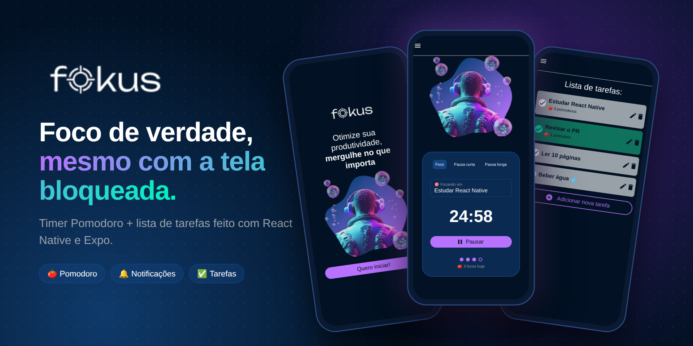
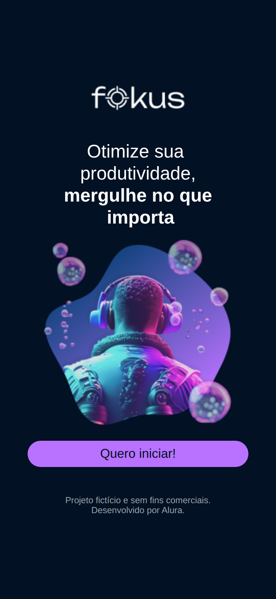
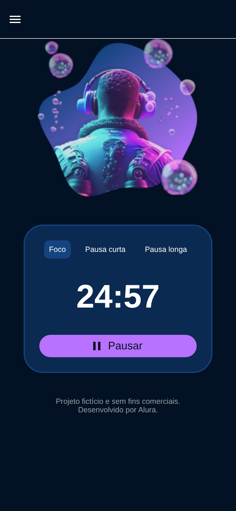
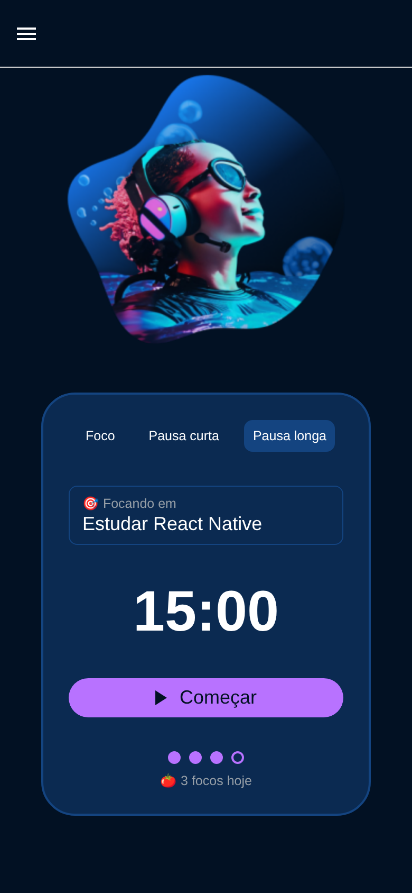
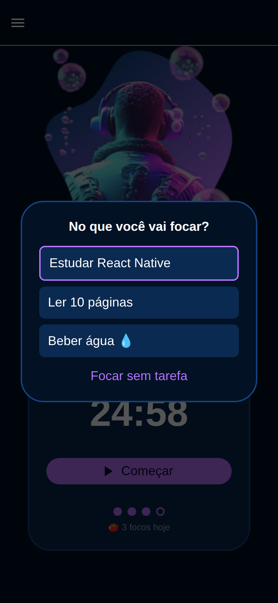
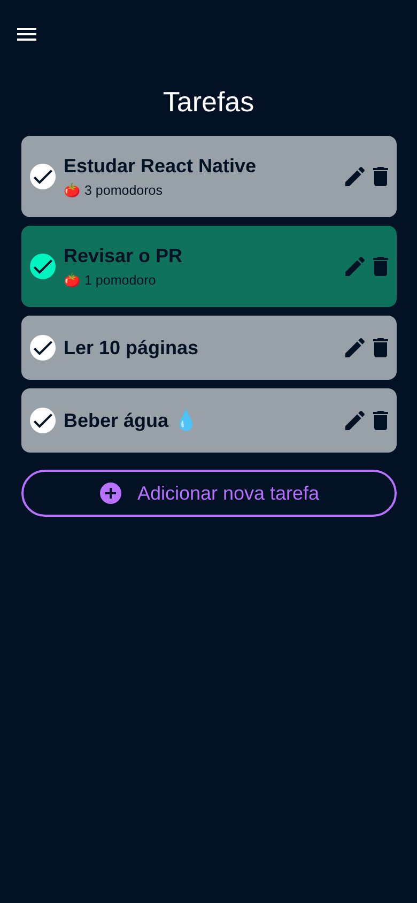
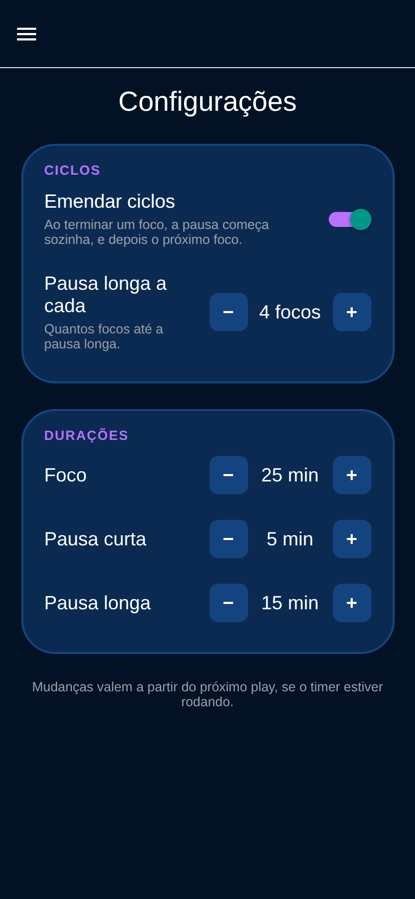
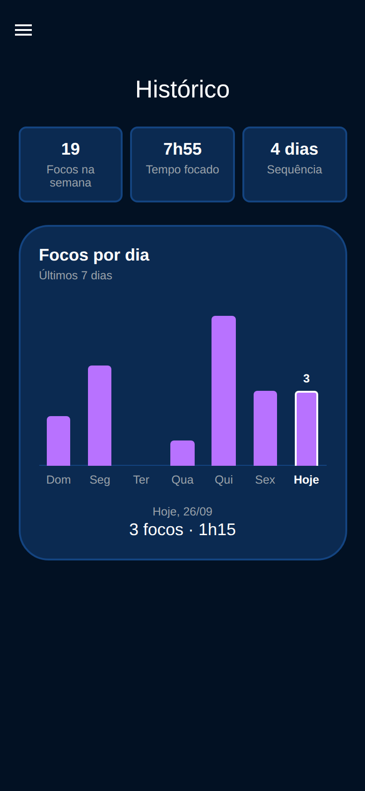
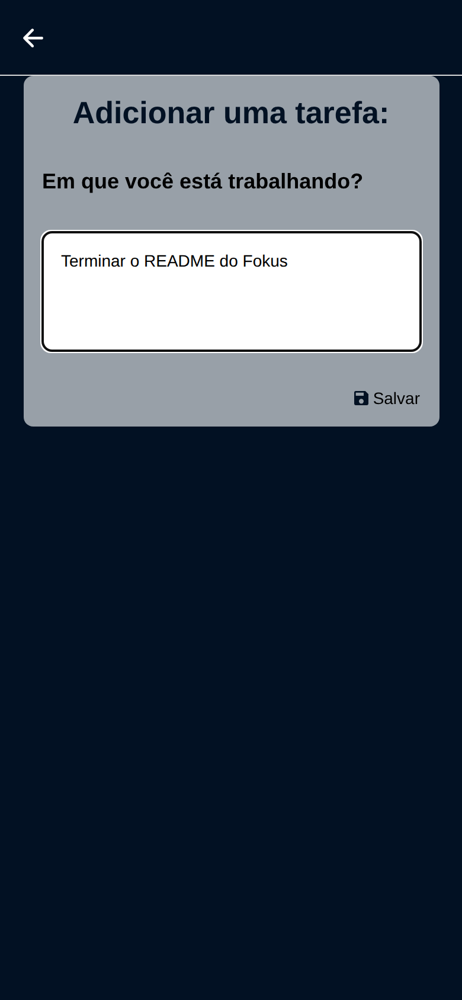
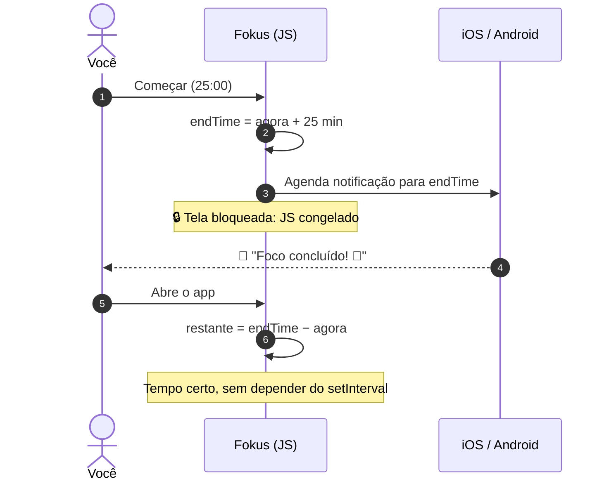

<div align="center">



# 🍅 Fokus

**Timer Pomodoro + lista de tarefas para quem quer mergulhar no que importa.**

Bloqueie a tela, guarde o celular e volte a focar. Quando o tempo acabar, o Fokus te avisa. 🔔

<br>


[](https://github.com/ramongime/Fokus/actions/workflows/ci.yml)

[Funcionalidades](#-funcionalidades) •
[Telas](#-telas) •
[Como funciona](#-o-segredo-do-timer-em-segundo-plano) •
[Rodando](#-rodando-o-projeto) •
[Arquitetura](#%EF%B8%8F-arquitetura) •
[Roadmap](#%EF%B8%8F-roadmap)

</div>

---

## ✨ Funcionalidades

| | |
|---|---|
| ⏱️ **Três modos de timer** | Foco, Pausa curta e Pausa longa, com ilustração própria para cada um |
| 🔁 **Ciclos emendados** | Acabou o foco, a pausa começa sozinha; acabou a pausa, volta o foco. Dá para desligar nas configurações |
| 🍅 **Contador do dia** | Bolinhas mostram quanto falta para a pausa longa, que vem a cada 4 focos (configurável) |
| 📊 **Histórico da semana** | Gráfico de focos por dia, tempo focado, total da semana e sequência de dias seguidos |
| 🎯 **Foco em uma tarefa** | Escolha no que está trabalhando; cada foco concluído soma um 🍅 na tarefa |
| ⚙️ **Configurações** | Durações de cada modo, intervalo da pausa longa, emendar ciclos e vibração |
| 🔒 **Funciona com a tela bloqueada** | O tempo é calculado a partir do horário de término, então nada se perde quando o celular dorme |
| 📳 **Vibração no fim do ciclo** | O celular vibra junto com a notificação, mesmo com a tela bloqueada. Dá para desligar |
| 🔔 **Notificação no fim do ciclo** | Agendada direto no sistema operacional: chega mesmo com o app em segundo plano ou fechado, avisando qual ciclo começou |
| 💾 **Retoma de onde parou** | Fechou o app no meio do foco? Ao abrir, o timer continua certinho |
| ✅ **Lista de tarefas completa** | Criar, editar, concluir e excluir (com confirmação), tudo salvo no aparelho |
| ♿ **Acessível** | Botões de ícone com descrição para leitores de tela (TalkBack e VoiceOver) |
| 🎨 **Tema escuro com personalidade** | Paleta centralizada em um único arquivo, fácil de customizar |

---

## 📱 Telas

<div align="center">

| Boas-vindas | Foco rolando | Pausa longa |
|:---:|:---:|:---:|
|  |  |  |

| No que você vai focar? | Suas tarefas | Configurações |
|:---:|:---:|:---:|
|  |  |  |

| Histórico da semana | Nova tarefa |
|:---:|:---:|
|  |  |

</div>

---

## 🧠 O segredo do timer em segundo plano

Quando a tela bloqueia, o sistema **congela o JavaScript** do app. Um timer que só faz
`segundos - 1` a cada `setInterval` simplesmente para. O Fokus resolve isso em três camadas:



1. **Horário de término, não contador.** O app guarda o horário em que cada ciclo termina e mostra
   sempre `término - agora`. Com os ciclos emendados, ele planeja os próximos 8 ciclos de uma vez
   (foco, pausa, foco...), então mesmo que você só abra o app 1 hora depois, ele sabe em qual
   ciclo está e quantos focos você completou.
2. **Recalcula ao voltar.** Um listener de `AppState` atualiza o tempo assim que o app fica ativo.
3. **Quem avisa é o sistema.** Uma notificação local (`expo-notifications`) é agendada no iOS/Android
   para o fim de cada ciclo planejado, e ele entrega mesmo com o app suspenso. Pausar ou trocar de
   modo cancela os avisos. No Android, a vibração vem do canal da notificação, então também
   funciona com a tela bloqueada.

A lógica pura (planejar ciclos, decidir a próxima pausa, contar focos do dia) fica em
[`timerLogic.js`](components/context/timerLogic.js), coberta por testes. O estado mora em
[`TimerProvider.jsx`](components/context/TimerProvider.jsx) e as notificações em
[`timerNotifications.js`](components/context/timerNotifications.js).

---

## 🚀 Rodando o projeto

**Pré-requisitos:** [Node.js](https://nodejs.org/) 18+ e o app
[Expo Go](https://expo.dev/go) no celular (ou um emulador Android/iOS).

```bash
# 1. Clone
git clone https://github.com/ramongime/Fokus.git
cd Fokus

# 2. Instale as dependências
npm install

# 3. Suba o servidor do Expo
npx expo start
```

Escaneie o QR code com o Expo Go e pronto. 🎉

> [!TIP]
> Quer ver a notificação sem esperar 25 minutos? Troque temporariamente `25 * 60` por `10`
> em [`constants/pomodoro.js`](constants/pomodoro.js), dê play e bloqueie a tela.

### 📦 Build nativo

Para testar o ícone, a tela de abertura e a vibração do Android como no app instalado:

```bash
npx expo run:android   # precisa do Android Studio (SDK) instalado
npx expo run:ios       # só no macOS, com Xcode
```

O identificador do app é `com.ramongime.fokus` nas duas plataformas.

> [!NOTE]
> No Android, a permissão de alarme exato (para a notificação chegar no segundo certo mesmo
> em modo economia de bateria) só vale em build nativo (`npx expo run:android`).
> O passo a passo de build no iPhone está em [`Documentos/`](Documentos/).

### 📜 Scripts

| Comando | O que faz |
|---|---|
| `npm start` | Inicia o Expo (Expo Go, emulador ou web) |
| `npm run android` / `npm run ios` / `npm run web` | Abre direto na plataforma |
| `npm test` | Roda os testes (Jest + jest-expo) |
| `npm run test:watch` | Testes em modo observação |
| `npm run lint` | ESLint com as regras do Expo |
| `npm run format` | Formata o código com Prettier |
| `npm run screenshots` | Gera de novo o banner e as capturas deste README* |

\* Na primeira vez, rode `npx playwright install chromium`. O script exporta a versão web,
abre o app num navegador do tamanho de um iPhone com dados de exemplo e salva as imagens em
[`docs/`](docs/).

---

## 🏗️ Arquitetura

```
fokus/
├── app/                         # 🧭 Rotas (expo-router, uma tela por arquivo)
│   ├── _layout.jsx              #    Providers + menu lateral (Drawer)
│   ├── index.jsx                #    Boas-vindas
│   ├── pomodoro.jsx             #    Timer
│   ├── history.jsx              #    Histórico da semana
│   ├── settings.jsx             #    Configurações
│   ├── tasks/index.jsx          #    Lista de tarefas
│   ├── add-task/index.jsx       #    Nova tarefa
│   └── edit-task/[id].jsx       #    Editar tarefa
├── components/                  # 🧩 Componentes visuais (dados e ações via props)
│   ├── FokusButton/  Timer/  TaskItem/  TaskPicker/  PomodoroCounter/
│   ├── WeekChart/  StatTile/  SettingRow/  Stepper/  FormTask/
│   ├── ConfirmModal/  Icons/ ...
│   └── context/                 # 🧠 Estado global
│       ├── SettingsProvider.jsx #    Configurações + AsyncStorage
│       ├── TaskProvider.jsx     #    Tarefas + AsyncStorage
│       ├── TimerProvider.jsx    #    Timer, ciclos, histórico + notificações
│       ├── timerLogic.js        #    Regras puras do timer (testadas)
│       ├── historyLogic.js      #    Histórico por dia, semana e sequência (testadas)
│       └── timerNotifications.js
├── constants/                   # 🎛️ Configuração
│   ├── theme.js                 #    Cores, fontes e raios
│   ├── settings.js              #    Configurações padrão e limites
│   └── pomodoro.js              #    Modos do timer e textos das notificações
├── scripts/screenshots.mjs      # 📸 Gera as imagens do README
├── .github/workflows/ci.yml     # 🤖 Lint + testes + bundle a cada push
└── docs/                        # 🖼️ Imagens deste README
```

**Como as peças se encaixam:**

- 🧭 **Telas finas**: pegam dados de um hook (`useTaskContext`, `useTimerContext`, `useSettingsContext`) e montam a UI.
- 🧠 **Um Provider por domínio**: estado, persistência no `AsyncStorage` e ações ficam juntos.
- 🧩 **Componentes burros**: recebem tudo por props e nunca acessam o contexto.
- 📝 **Um formulário para criar e editar**: `FormTask` muda só pelo `defaultValue`.
- 🎨 **Tema único**: nenhuma cor solta; tudo vem de [`constants/theme.js`](constants/theme.js).
- 🧪 **Regras em funções puras**: a lógica do timer e do histórico fica em `timerLogic.js` e
  `historyLogic.js`, sem React, e é testada. Os arquivos de lógica têm comentários explicando o papel de cada parte.

### 🤖 Qualidade

A cada push na `main` e em todo pull request, o [GitHub Actions](.github/workflows/ci.yml)
roda o lint, os testes e gera o bundle Android. Se algo quebrar, o selo **CI** lá em cima
fica vermelho.

Quer usar esse mesmo padrão em outro app? Tem uma skill pronta em
[`.claude/skills/expo-app-pattern`](.claude/skills/expo-app-pattern/SKILL.md), com regras e templates.

---

## 🎨 Paleta

| | Token | Hex |
|:---:|---|---|
|  | `background` | `#021123` |
|  | `surface` | `#144480` |
|  | `primary` | `#B872FF` |
|  | `success` | `#00F4BF` |
|  | `successDark` | `#0F725C` |
|  | `muted` | `#98A0A8` |

---

## 🗺️ Roadmap

- [x] Timer com três modos
- [x] Lista de tarefas com persistência local
- [x] Timer que sobrevive à tela bloqueada
- [x] Notificação no fim de cada ciclo
- [x] Emendar automaticamente foco → pausa → foco (com opção de desligar)
- [x] Vincular uma tarefa ao pomodoro em andamento
- [x] Contador de pomodoros concluídos por dia
- [x] Durações personalizáveis
- [x] Testes automatizados com `jest-expo`
- [x] Confirmação antes de excluir e acessibilidade
- [x] CI no GitHub Actions
- [x] Vibrar no fim de cada ciclo
- [x] Histórico da semana com gráfico
- [ ] Histórico do mês e metas diárias
- [ ] Sons diferentes para foco e pausa
- [ ] Widget na tela inicial do celular
- [ ] Build instalável com EAS

---

## 🙌 Créditos

Projeto nascido no curso de **React Native da [Alura](https://www.alura.com.br/)** e evoluído
com timer em segundo plano, notificações, ciclos emendados, contador diário, tarefas vinculadas
ao foco, configurações, vibração, histórico com gráfico, testes, tema centralizado e lint.

<div align="center">

Feito com ☕ e muitos 🍅 por **Ramon Gimenes**

[](https://www.linkedin.com/in/ramon-gimenes/)
[](https://github.com/ramongime)

</div>
