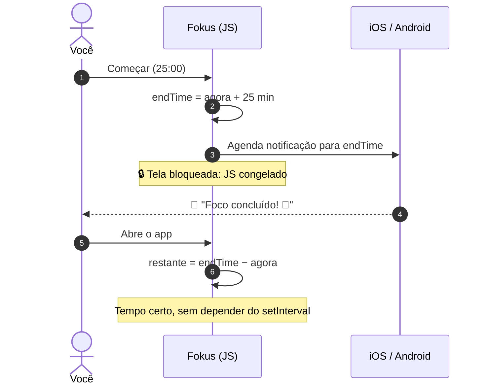

<div align="center">


# 🍅 Fokus

**Timer Pomodoro + lista de tarefas para quem quer mergulhar no que importa.**

Bloqueie a tela, guarde o celular e volte a focar. Quando o tempo acabar, o Fokus te avisa. 🔔

<br>


[Funcionalidades](#-funcionalidades) •
[Telas](#-telas) •
[Como funciona](#-o-segredo-do-timer-em-segundo-plano) •
[Rodando](#-rodando-o-projeto) •
[Arquitetura](#%EF%B8%8F-arquitetura) •
[Roadmap](#%EF%B8%8F-roadmap)

</div>

---

## ✨ Funcionalidades

| | |
|---|---|
| ⏱️ **Três modos de timer** | Foco (25 min), Pausa curta (5 min) e Pausa longa (15 min), com ilustração própria para cada um |
| 🔒 **Funciona com a tela bloqueada** | O tempo é calculado a partir do horário de término, então nada se perde quando o celular dorme |
| 🔔 **Notificação no fim do ciclo** | Agendada direto no sistema operacional: chega mesmo com o app em segundo plano ou fechado |
| 💾 **Retoma de onde parou** | Fechou o app no meio do foco? Ao abrir, o timer continua certinho |
| ✅ **Lista de tarefas completa** | Criar, editar, concluir e excluir, tudo salvo no aparelho |
| 🎨 **Tema escuro com personalidade** | Paleta centralizada em um único arquivo, fácil de customizar |

---

## 📱 Telas

<div align="center">

| Boas-vindas | Foco rolando | Pausa longa |
|:---:|:---:|:---:|
|  |  |  |

| Suas tarefas | Nova tarefa |
|:---:|:---:|
|  |  |

</div>

---

## 🧠 O segredo do timer em segundo plano

Quando a tela bloqueia, o sistema **congela o JavaScript** do app. Um timer que só faz
`segundos - 1` a cada `setInterval` simplesmente para. O Fokus resolve isso em três camadas:



1. **Horário de término, não contador.** O app guarda `endTime` e mostra sempre `endTime - agora`.
2. **Recalcula ao voltar.** Um listener de `AppState` atualiza o tempo assim que o app fica ativo.
3. **Quem avisa é o sistema.** A notificação local (`expo-notifications`) é agendada no iOS/Android,
   que a entrega mesmo com o app suspenso. Pausar ou trocar de modo cancela o aviso.

Tudo isso vive em [`TimerProvider.jsx`](components/context/TimerProvider.jsx) e
[`timerNotifications.js`](components/context/timerNotifications.js).

---

## 🚀 Rodando o projeto

**Pré-requisitos:** [Node.js](https://nodejs.org/) 18+ e o app
[Expo Go](https://expo.dev/go) no celular (ou um emulador Android/iOS).

```bash
# 1. Clone
git clone https://github.com/ramongime/Fokus.git
cd Fokus

# 2. Instale as dependências
npm install

# 3. Suba o servidor do Expo
npx expo start
```

Escaneie o QR code com o Expo Go e pronto. 🎉

> [!TIP]
> Quer ver a notificação sem esperar 25 minutos? Troque temporariamente `25 * 60` por `10`
> em [`constants/pomodoro.js`](constants/pomodoro.js), dê play e bloqueie a tela.

> [!NOTE]
> No Android, a permissão de alarme exato (para a notificação chegar no segundo certo mesmo
> em modo economia de bateria) só vale em build nativo (`npx expo run:android`).
> O passo a passo de build no iPhone está em [`Documentos/`](Documentos/).

### 📜 Scripts

| Comando | O que faz |
|---|---|
| `npm start` | Inicia o Expo (Expo Go, emulador ou web) |
| `npm run android` / `npm run ios` / `npm run web` | Abre direto na plataforma |
| `npm run lint` | ESLint com as regras do Expo |
| `npm run format` | Formata o código com Prettier |

---

## 🏗️ Arquitetura

```
fokus/
├── app/                         # 🧭 Rotas (expo-router, uma tela por arquivo)
│   ├── _layout.jsx              #    Providers + menu lateral (Drawer)
│   ├── index.jsx                #    Boas-vindas
│   ├── pomodoro.jsx             #    Timer
│   ├── tasks/index.jsx          #    Lista de tarefas
│   ├── add-task/index.jsx       #    Nova tarefa
│   └── edit-task/[id].jsx       #    Editar tarefa
├── components/                  # 🧩 Componentes visuais (dados e ações via props)
│   ├── FokusButton/  ActionButton/  Timer/  TaskItem/  FormTask/  Icons/ ...
│   └── context/                 # 🧠 Estado global
│       ├── TaskProvider.jsx     #    Tarefas + AsyncStorage
│       ├── TimerProvider.jsx    #    Timer + AsyncStorage + notificação
│       └── timerNotifications.js
├── constants/                   # 🎛️ Configuração
│   ├── theme.js                 #    Cores, fontes e raios
│   └── pomodoro.js              #    Modos do timer e textos das notificações
└── docs/                        # 🖼️ Imagens deste README
```

**Como as peças se encaixam:**

- 🧭 **Telas finas**: pegam dados de um hook (`useTaskContext`, `useTimerContext`) e montam a UI.
- 🧠 **Um Provider por domínio**: estado, persistência no `AsyncStorage` e ações ficam juntos.
- 🧩 **Componentes burros**: recebem tudo por props e nunca acessam o contexto.
- 📝 **Um formulário para criar e editar**: `FormTask` muda só pelo `defaultValue`.
- 🎨 **Tema único**: nenhuma cor solta; tudo vem de [`constants/theme.js`](constants/theme.js).

Quer usar esse mesmo padrão em outro app? Tem uma skill pronta em
[`.claude/skills/expo-app-pattern`](.claude/skills/expo-app-pattern/SKILL.md), com regras e templates.

---

## 🎨 Paleta

| | Token | Hex |
|:---:|---|---|
|  | `background` | `#021123` |
|  | `surface` | `#144480` |
|  | `primary` | `#B872FF` |
|  | `success` | `#00F4BF` |
|  | `successDark` | `#0F725C` |
|  | `muted` | `#98A0A8` |

---

## 🗺️ Roadmap

- [x] Timer com três modos
- [x] Lista de tarefas com persistência local
- [x] Timer que sobrevive à tela bloqueada
- [x] Notificação no fim de cada ciclo
- [ ] Emendar automaticamente foco → pausa → foco
- [ ] Vincular uma tarefa ao pomodoro em andamento
- [ ] Contador de pomodoros concluídos por dia
- [ ] Durações personalizáveis
- [ ] Testes automatizados com `jest-expo`

---

## 🙌 Créditos

Projeto nascido no curso de **React Native da [Alura](https://www.alura.com.br/)** e evoluído
com timer em segundo plano, notificações, persistência do timer, tema centralizado e lint.

<div align="center">

Feito com ☕ e muitos 🍅 por **Ramon Gimenes**

[](https://www.linkedin.com/in/ramon-gimenes/)
[](https://github.com/ramongime)

</div>
